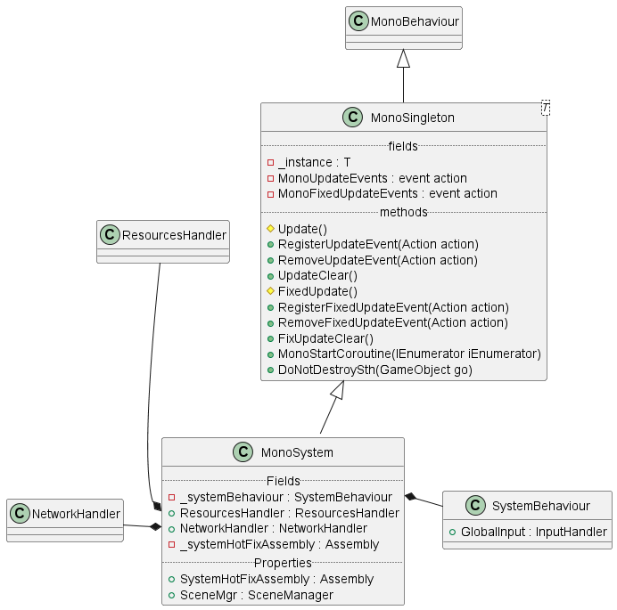
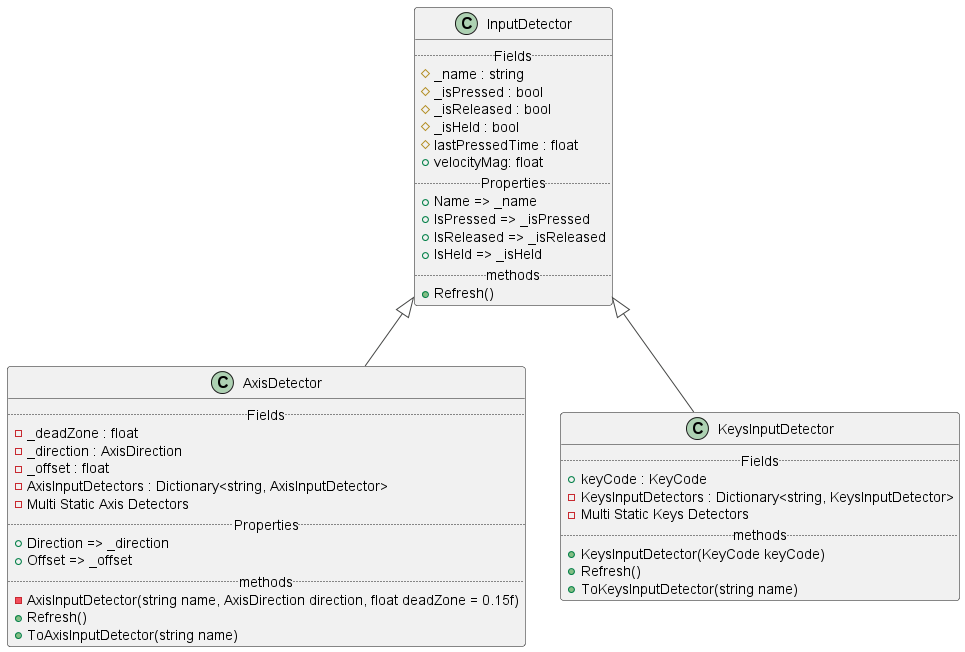
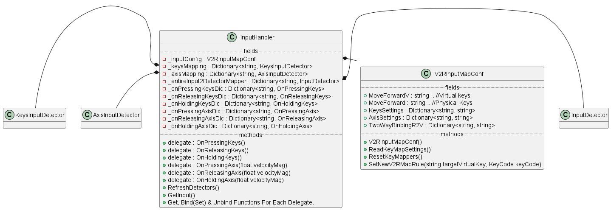

# Sour Night

项目地址：
> https://github.com/JBR-Bunjie/OnlineGameTest

## 关于项目

最初是打算用于验证热更新的实验项目，该项目实现了以下内容：
- 基于Addressables的AB资源管理
- 基于HybridCLR的热更新

同时还存在这些：

- 使用 **Luban** 进行Excel数据对代码的程序化生成
- 存在一个使用flask的简易后台，接口于 `Scripts/NetworkProcessor/NetworkHandler.cs`
- 一些自己编写的Shader和用于生成Mesh的脚本等

## 已成型的主要模块架构

### GameWorld

游戏的总起模块，挂载在StartScene上的MonoSystem上，继承了MonoBehaviour

我们有两种单例，一种是继承了MonoBehaviour的，一种则没有

MonoSystem是继承了MonoBehaviour的单例系统，其结构如下：

其中，
- NetworkHandler是对于使用UnityWebRequest的封装
- ResourcesHandler则是基于Addressables的资源检测及加载脚本
- SystemBehaviour则定义了系统级别的操作比如退出、暂停等

在这样的设计下，调用协程、使用Update功能等，就不再不要自己继承MonoBehaviour

### 输入

#### 需求

Unity中默认自带的Input Manager只提供了检测的支持，而新的Input System并不好用

为了保证游戏输入模块本身的高效、易用，以及与其它功能的解耦，有必要在Input Manager的基础上重新设计一套新的输入模块

#### 输入检测器实体(Entity)    

整个输入模块以各类Detectors为核心功能，它们负责了用户实际按键的检测。

在我们的定义中，检测内容包括轴类输入的检测和按键输入的检测，最后呈现出来如下的关系：

在这样的定义下，外部不允许创建检测器，而只能通过ToAxisInputDetector()来从类中的Dictionary中寻找预创建号的检测器，保证了检测器的唯一性

#### 输入控制器(Handler)

实际与外部交互的输入模块由InputHandler完成，其总体结构如下：

通过V2RInputMapConf，在PlayerPref中，获取用户设定的实际按键与逻辑上的虚拟按键的对应关系，并据此存储到统揽可用监听器的`__entireInput2DetectorMapper`中

每次Update都会调用GetInput()，去遍历每个`_entireInput2DetectorMapper`中已挂载的对应检测器来获取当次用户输入，同时根据delegate上绑定的信息信息调用，并在结束时Refresh

利用观察者模式，可以方便地调用各个挂载到delegate上的商法，因此我们向外暴露了对应的delegate操作方法，包括：绑定、解绑、查看已绑定方法

通过这样的方式，我们就实现了一个相对完整的输入系统，避免了MonoBehaviour的同时，能够允许用户自定义键位等行为。

此外，还有基于MVC构建的UI、事件池，对象池，场景管理的Manager，基于状态模式的CharacterManager等虽然能实现功能，但并未形成模块的部分，不值得细加说明。